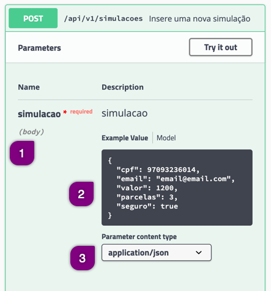

# Documentação de uma API REST

Uma API REST sempre possui uma documentação de funcionamento. Normalmente a documentação de como efetuar as requisições, com os caminhos (paths) necessários, parâmetros e tipos de retorno são disponibilizados através de uma ferramenta de documentação de APIs chamada [Swagger](https://swagger.io/).

O Swagger é disponibilizado no próprio endereço da aplicação, onde devemos inserir ao final da URL o texto `swagger-ui.html`.

## Documentação do projeto para automação

Efetue o acesso no endereço [http://localhost:8089/swagger-ui.html](http://localhost:8089/swagger-ui.html)

## Explicação da documentação

Na página inicia da documentação você visualizará dois itens:
 * Restrições
 * Simulações

Eles são chamados de _controllers_ e cada um é responsável por efetuar uma ou mais ações de API para este contexto.


___

### Restrição

Este _controller_ possui apenas duas chamadas do tipo _GET_ e o intuito é efetuar uma consulta para saber se o CPF informado possui uma restrição.

Note que há sempre um padrão em toda documentação de cada _controller_:
1. Método HTTP
2. URL da requisição
3. Descrição da requisição


Quando clicamos sobre a chamada (linha que tem o método HTTP + URL + descrição) podemos visualizar o detalhe da requisição e saber informações importantes como:
1. Parâmetros
2. Resposta


#### Parâmetros

Os parâmetros geralmente são informações obrigatórias, ou não. Há dois tipos de parâmetros:
* path parameter: onde inserimos as informações diretamente na URL
* query parameter: onde inserimos o atributo e o valor diretamente na URL

No exemplo das Restrições temos um _path parameter_. Sempre que temos este tipo de parâmetros é comum visualizar o parâmetro com o nome do atributo em colchetes. Exemplo: `{cpf}`.

A sessão _Parameters_ apresenta quais são os parâmetros existentes, o nome do atributo, o tipo de dados e se o mesmo é obrigatório ou não.

#### Respostas

As respostas não muito importantes no contexto de desenvolvimento e testes. Apresentam comportamentos frente a fluxos principais (esperados), fluxos de excessão e de regras de negócio.

Dois itens são importantes e sempre devem ser validos:
* Code: Status code do retorno da requisição
* Descrição: onde consta o que é esperado e, opcionalmente, exemplos do retorno (_Response Body_)

No exemplo abaixo vemos:
1. O _Code_ como 200 para uma pessoa que possui restrição
2. O exemplo de retorno (_Response Body_) como 
`
{
  "mensagem": "O CPF 999999999 não foi encontrado"
}
` Logo, quando efetuarmos uma requisição para um CPF que possui uma restrição, receberemos estas duas informações.

3. O _Code_ como 204 para uma pessoa que não possui restrição e sem retorno (sem _Response Body_)


---

### Simulações

A simulação é um CRUD onde podemos inserir uma simulação de crédito. Note que na simulação existem diferentes requisições, uma para cada ação do CRUD.


Na explicação que virá a seguir teremos apenas descritivos sem imagem. A ideia é que você acesse a documentação de cada requisição para visualizar como é a descrição lá e para que você se acostume em utiliza-la.

#### GET /api/v1/simulacoes

Esta requisição retorna todas as simulações existentes. Note que, o _Example Value_ inicia o exemplo com colchetes. Isso quer dizer que o retorno é um array de elementos (simulações). Quando existir mais de uma simulação cadastrada ela será separada por vírgulaa após o fechamento da chaves. Exemplo:
```json
[
  {
    "id": 11,
    "cpf": "66414919004",
    "email": "fulano@gmail.com",
    "valor": 11000,
    "parcelas": 3,
    "seguro": true
  },
  {
    "id": 12,
    "cpf": "97093236014",
    "email": "email@email.com",
    "valor": 1200,
    "parcelas": 3,
    "seguro": true
  }
]
```

#### GET /api/v1/simulacoes/{cpf}

Esta requisição retorna uma simulação existente dado um CPF.

Caso a simulação seja encontrada, todos os dados da simulação serão retornados e o _status code_ será 200. Se a simulação para o CPF desejado não existir, o _status code_ deverá ser 404 e o _response body) `{
  "mensagem": "O CPF 999999999 não foi encontrado"
}`

#### POST /api/v1/simulacao

Esta requisição cria um recurso (neste caso uma simulação). 

Note o seguinte na sessão **Parameters**:
1. O parâmetro esperado é uma _simulacao_ e o tipo é um _body_. 
2. Quando isso acontecer você deve enviar os mesmos atributos contidos no _Exemple Value_
3. O tipo da body deve ser igual ao item contido no campo _Parameter content type_. Nesta caso um _application/json_



Quando a simulação for criada com sucesso o _status code_ deverá ser 200 e o _response body_ a simulação com todos os seus atributos.

Quando algum atributo não for preenchido (talvez esquecido) o _status code_ retornado é o 400 e o _response body_ irá mostrar um array de `erros` informando o atributo que não foi informado e uma descrição.

Quando já existir o CPF previamente cadastrado o _status code_ será 409 e não haverá dados no _response body_

#### PUT /api/v1/simulacao/{cpf}

Esta requisição atualiza algum atributo (dado) de uma simulação existente. A chave de pesquisa da simulação existente é o CPF.

Você pode alterar todas os atributos ou somente os que você escolher.

Quando a alteração for executada com sucesso o _status code_ será 200 e o _response body_ a simulação com todos os seus atributos.

Quando a alteração para a simulação com CPF desejado não existir, o _status code_ deverá ser 404 e o _response body) `{
  "mensagem": "O CPF 999999999 não foi encontrado"
}`

Quando já existir o CPF previamente cadastrado o _status code_ será 409 e não haverá dados no _response body_.

#### DELETE /api/v1/simulacao/{cpf}

Esta requisição remove uma simulação existente. A chave de pesquisa da simulação existente é o CPF.

Quando uma simulação for removida com sucesso o _status code_ será 204 e não haverá dados no _response body_.

Quando o CPF não existir o _status code_ será 404 e o _response body) `{
  "mensagem": "O CPF 999999999 não foi encontrado"
}` 


