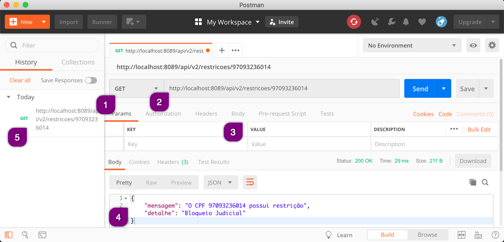

# O que é Postman

O Postman é uma ferramenta para realizar requisições HTTP. Comumente ele é utilizado para efetuar requisições em um endpoint de API REST. Estas requisições são compostas por um método HTTP e uma URL.

Com ele podemos efetuar estas requisições através de uma interface gráfica ao invés de usar ferramentas de linha de comando, de forma intuitiva e de rápido aprendizado.

## Composição da Interface Gráfica

### 1 - Método HTTP

Aqui você seleciona o método HTTP, onde os mais comuns são GET, POST, PUT e DELETE.

### 2 - URL

Aqui você insere a URL completa (URI e contexto) para a chamada da API.

### 3 - Parâmetros, Headers e Body

Você pode, quando necessário:
* Inserir parâmetros na requisição (aba _Params_)
* Inserir Headers específicos (aba _Headers_)
* Inserir dados na requisição (aba _Body_)

### 4 - ResponseBody

Uma vez enviado a requisição um retorno, geralmente chamado de _ResponseBody_ é gerado. Sempre composto pelos dados da body e Status code.

### 5 - Histórico

Todas os envios de requisições ficam listados como histórico.
