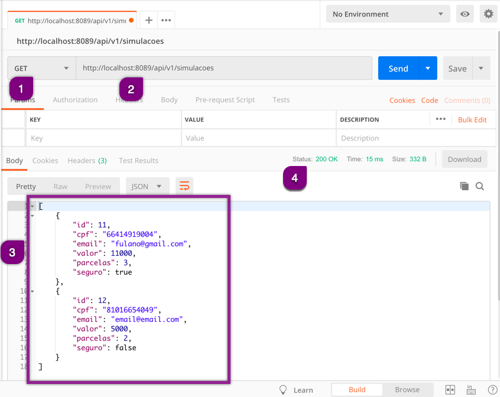
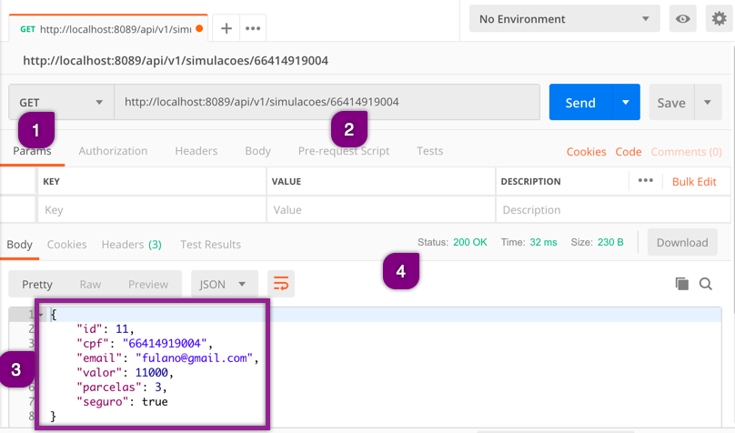

# Efetuando uma requisição GET

A requisição GET sempre será composta por:
 * Método HTTP GET
 * URL
 * Resposta
    * Body
    * Status

A body, em quase 100% dos casos, **retornará** recursos (dados) que chamamos de ResponseBody.

Sempre há uma diferenciação simples e prática nas requisições _GET_:
 * Quando não há parâmetros no path são retornados todos os dados do recurso
 * Quando há parâmetro somente é retornado o recurso cujo parâmetro esteja presente (Ex: ID ou CPF, etc..)

## Exemplo de GET no retorno de recursos

1. Preenchemos o método HTTP como _GET_
2. Inserimos a _URL_ completa da API para este método HTTP e enviamos a requisição
3. Visualizamos o retorno (_Response Body_)
4. Visualizamos o _Status_

Note que o _Response Body_ inicia com colchetes ( `[ ]` ). Isso significa que temos como retorno um array de objetos (neste caso simulações), onde cada objeto (simulação) está composto por chaves (`{ }`) e separados por vírgula.

Outro ponto importante que você sempre deve notar é se o _Status_ corresponde ao status contido na documentação como o correto.

## Exemplo de GET com path

Um GET com path geralmente possui um identificador para trazer um único recurso. A documentação mostra qual deve ser o identificador. No caso do exemplo abaixo o identificador é o CPF, logo o retorno da requisição, quando existir um recurso com o CPF informado, retornará somente aquele recurso.

1. Preenchemos o método HTTP como *GET*
1. Inserimos a *URL* completa da API para este método HTTP com o identificador
1. Visualizamos o retorno (*Repsonse Body*)
1. Visualizamos o *Status*

Note que o _Response Body_ inicia com chaves (`{ }`), onde é um objeto (simulação). Ele retorna o recurso para o identificador (cpf), se existente.