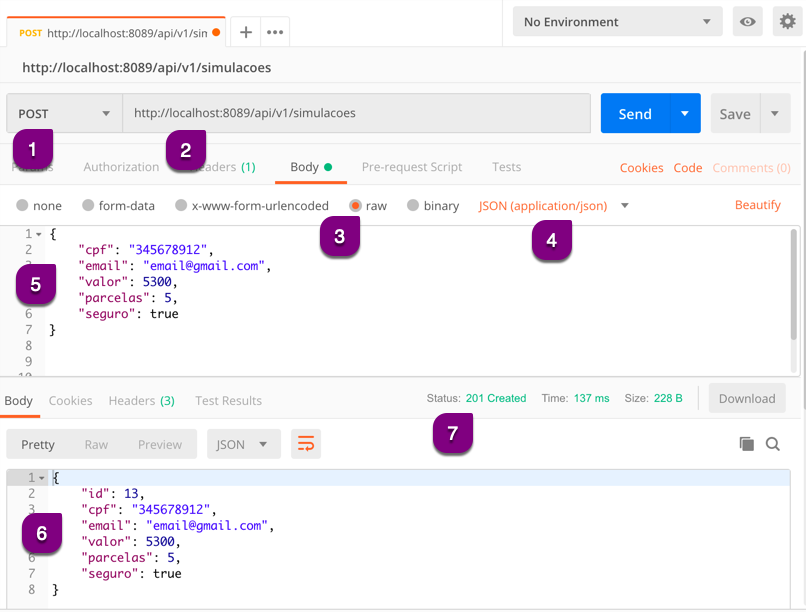

# Efetuando uma requisição POST

A requisição POST sempre será composta por:

* Método HTTP POST
* URL
* Dados (Body)
* Resposta
  * Body
  * Status

Esta requisição **cria** um novo recurso, por isso da obrigatoriedade de enviar os dados (Body) na requisição.

## Exemplo de POST na criação de recursos

1. Preenchemos o método HTTP como _POST_
2. Inserimos a *URL* completa da API para este método HTTP
3. Na aba _Body_ clicamos no item _raw_
4. Selecionamos o tipo de conteúdo (_Content-Type_) como _JSON (application/json)_ e enviamos a requisição
5. Inserimos os dados da _Body_ de acordo com a documentação da API
6. Visualizamos o retorno (*Response Body*)
7. Visualizamos o _Status_

