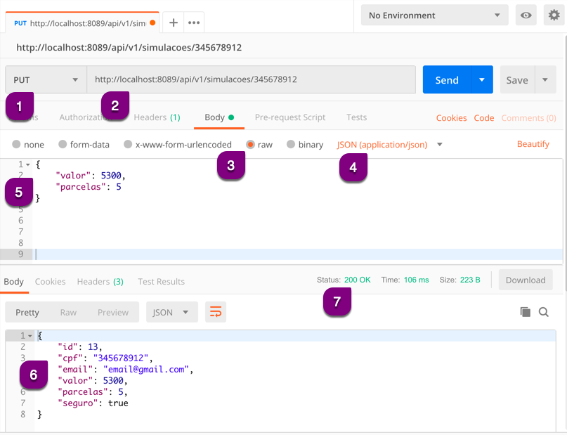

# Efetuando uma requisição PUT

A requisição PUT sempre será composta por:

* Método HTTP PUT
* URL com identificador
* Dados (Body)
* Resposta
  * Body
  * Status

Esta requisição **atualiza** um recurso existente , por isso da obrigatoriedade de enviar os dados (_Body_) e um identificador na requisição.

## Exemplo de PUT na alteração de recursos

1. Preenchemos o método HTTP como *PUT*
2. Inserimos a *URL* completa da API para este método HTTP com o identificador
3. Na aba *Body* clicamos no item *raw*
4. Selecionamos o tipo de conteúdo (*Content-Type*) como *JSON (application/json)*
5. Inserimos os dados da *Body* de acordo com a documentação da API e dos dados que queremos alterar e enviamos a requisição
6. Visualizamos o retorno (*Response Body*)
7. Visualizamos o *Status*

