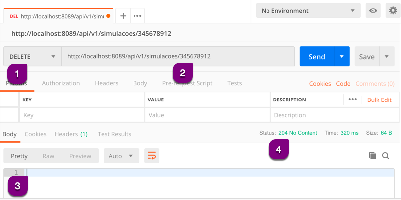

# Efetuando uma requisição DELETE

A requisição DELETE sempre será composta por:

* Método HTTP DELETE
* URL com identificador
* Resposta
  * Body vazia
  * Status

Esta requisição **remove** um recurso existente , por isso da obrigatoriedade de inserir um identificador na requisição.

## Exemplo de DELETE na remoção de recursos

1. Preenchemos o método HTTP como *DELETE*
2. Inserimos a *URL* completa da API para este método HTTP com o identificador e enviamos a requisição
3. Visualizamos o retorno (*Response Body*) vazio
4. Visualizamos o *Status*

