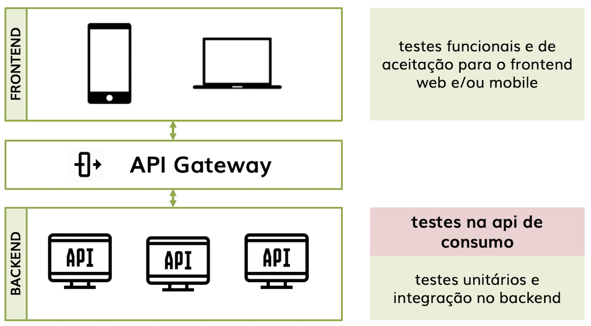

# Testes Automatizados para uma API REST

Com a adoção de Microserviços como arquitetura para distribuir aplicações de maneira escalável, separada por responsabilidade e de maneira a entregar somente o que se propõe a aplicação de testes para esta nova camada/arquitetura se faz necessário.

Uma arquitetura baseada em microserviços é disponibilizada através de serviços (APIs) em um *back-end*. Estes serviços são consumidos por diferentes *front-ends* (web, mobile, desktop...), existindo o que chamamos de *api gateway* para transportar somente os dados necessários para o front-end.

É comum que os desenvolvedores criem testes unitários e de integração para suas APIs. Também é comum QAs criarem testes no front-end web ou mobile. Mas em um projeto de microserviços precisamos também testar as chamadas (requisições) e suas respostas, o que chamamos na figura abaixo de *testes de api de consumo*. Se não é feita a correta validação nesta camada problemas no front-end podem aparecer.

