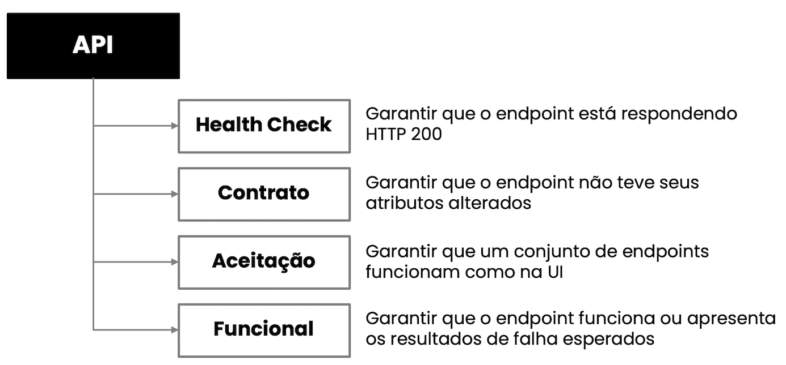

# Pipeline para automação de teste de API

Atualmente, no Sicredi, usamos o GitLab CI para executar as pipelines. Mas o que é uma pipeline?

## Pipeline

É a aplicação do processo de automação nas etapas do desenvolvimento das aplicações. Os exemplos mais clássicos são as pipelines de Continuous Integration (CI) e Continuous Delivery (CD). De modo geral é automatizar desde a compilação, execução de testes, empacotamento da aplicação e, em alguns casos, a entrega.

Em um processo simples de desenvolvimento fim-a-fim teríamos a pipeline abaixo:

```
compilação (build) -> testes unitários -> testes funcionais -> geração da aplicação para entrega
```

## Pipeline de automação de teste

O desenvolvimento de scripts de teste é um desenvolvimento de software. A diferença está no foco: nós estamos validando se a aplicação foi construída de acordos com os requisitos ao invés de construir a aplicação de acordo com os requisitos.

Quando criamos uma pipeline de automação de teste aplicamos os tipos de teste, que irão variar de acordo com o foco que você deseja.

## Pipeline de automação de testes de API

Quando falamos sobre testes de API, recomendamos a seguinte pipeline:



Como o pipeline é uma sequência, nós recomendamos a ordem acima porque:
* primeiro queremos saber se todos os serviços estão disponíveis (health check)
* depois queremos saber se todos os serviços possuem os contratos esperados (contrato)
* em seguida queremos saber se as jornadas dos usuários / cenários de uso não apresentam problemas (aceitação)
* no fim os testes funcionais para garantir os principais caminhos e os fluxos de excessão

