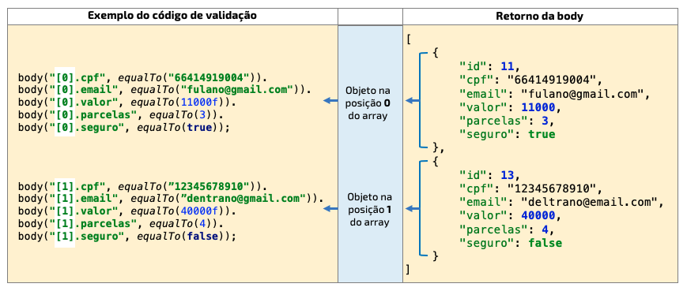

# Como validar os resultados esperados

Um script de teste automatizado só pode ser chamado assim se este conter formas de validar os resultados esperados de sua execução. Para que possamos validar os resultados esperados será necessário usar o método `then()` logo após a chamada do método HTTP.

```java
when().
    get("/simulacoes").
then().
    // validacoes dos resultados
```

É uma boa prática validar, pelo menos, dois itens do retorno da requisição:
* _status code_: código de status retornado pela requisição
* _body_: dados retornados pela requisição

Um exemplo de código com validações seria:

```java
when().
    get("/simulacoes").
then().
    statusCode(200).
    body(algumaCoisaAqui);
```

Para o _statusCode_ inserimos como parâmetro o código esperado pelo retorno do resultado.

Para a _body_ utilizamos uma diferença, que será explicado abaixo.

## Body como unico objeto

O método `body` refere-se aos dados de retorno da requisição, que geralmente está no formato JSON. Digamos que tenhamos o seguinte retorno da body de uma requisição do tipo GET:

```json
{
    "nome": "João",
    "idade": 27 
}
```

O método `body` do RestAssured espera receber dois parâmetros:
* atributo da body
* tipo de validação

O **atributo da body** é o atributo que é apresentado no retorno de dados da body. No exemplo que temos seria o _nome_  ou _idade_.

O **tipo de validação** é a forma que o valor retornado será validado. Para que o script possa fazer essa validação utilizamos métodos do Hamcrest chamados de _matchers_.

Na grande maioria dos casos utilizamos ou o matcher `is()` ou o matcher `equalTo()`. Semanticamente os dois fazem a mesma coisa: validam se um resultado `é` ou `é igual a`. Para ambos precisamos inserir como parâmetro o valor esperado.

O script abaixo mostra um exemplo de validação de dados.

```java
@Test
public void exemploValidacaoDados() {
    when().
        get("/simulacoes").
    then().
        statusCode(200).
        body("nome", is("João")).
        body("idade", is(27));
}
```

Note que, para cada atributo, teremos uma linha com o método `body`.

## Body como um array de objetos

Teremos o caso de um _body como um array de objetos_ quando:
* a body inicia e termina com colchetes
* a body possui objetos separados por vírgula (ou não no caso de apenas um registro)

O exemplo abaixo apresenta um retorno de body como um array contendo dois objetos:

```json
[
    {
        "id": 11,
        "cpf": "66414919004",
        "email": "fulano@gmail.com",
        "valor": 11000,
        "parcelas": 3,
        "seguro": true
    },
    {
        "id": 13,
        "cpf": "12345678910",
        "email": "deltrano@email.com",
        "valor": 40000,
        "parcelas": 4,
        "seguro": true
    }
]
```

Quando este tipo de situação ocorrer o primeiro parâmetro da body, que é o _atributo da body_ deve conter o índice do array + valor do atributo no seguinte formato:

`[indice].atributo`

O exemplo abaixo demonstra como inserir o índice para validar os atributos. No lado esquerdo temos dois objetos como retorno de um array. Como qualquer contagem de um array começa em zero (0), a primeira posição do array é zero. Note que, no lado direito, há as validações para cada um dos atributos utilizando o índice zero do array `[0]`. Para a segunda posição o índice do array é um (1), logo no segundo conjunto de validações é utilizado o índize um do array `[1]`.



