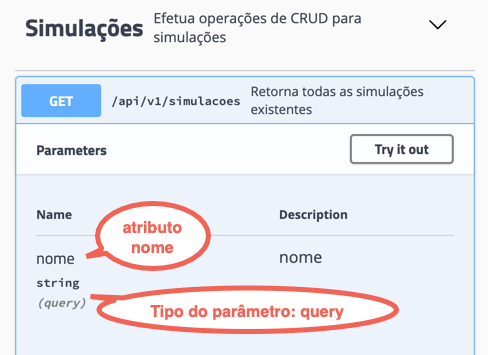

# Efetuando uma requisição com parâmetros de query

O segundo tipo de parâmetros para um API REST é o **query parameter**.

Como o próprio nome já diz, ele serve para efetuarmos pesquisas em atributos presentes na requisição. O parâmetro, que  é informado diretamente na URL, tem a seguinte sintaxe:

```bash
GET /api/v1/simulacoes?nome=Fulano
```

* O atributo deve:
   * iniciar com um ponto de interrogação (?)
   * seguido pelo nome do atributo
   * ter um sinal de igual (=)
   * E finalizar com o valor que desejamos pesquisar


No exemplo acima efetuamos uma requisição em *simulacoes* efetuando uma pesquisa no atributo *nome* com o valor *Fulano*.

## Como sei que o atributo é do tipo query parameter?

Se você olhar na documentação do Swagger os *controllers* mostrarão se existe um parâmetro para ser inserido, e qual o tipo. No *controller* [Simulações](http://localhost:8089/swagger-ui.html#/Simula%C3%A7%C3%B5es/getSimulacaoUsingGET) ha um parâmetro chamado `nome` que é do tipo `query`, logo ele é um *query parameter*.




## Como usar query parameter on RestAssured

No `given()` existe um método chamado `queryParameter` que recebe dois parâmetros:
* o nome do atributo que será pesquisado
* o valor do atributo para pesquisa

Exemplo:

URL: /api/v1/simulacoes?nome=Fulano

```java
given().
    queryParam("nome", "Fulano").
when().
    get("/simulacoes")
```

No exemplo acima estamos informando um *query parameter* com nome de atributo *nome* e valor de atributo *Fulano*. O rest-assured identificará esse comando e fará a inclusão da sintaxe `?atributo=valor` automaticamente na URL.


