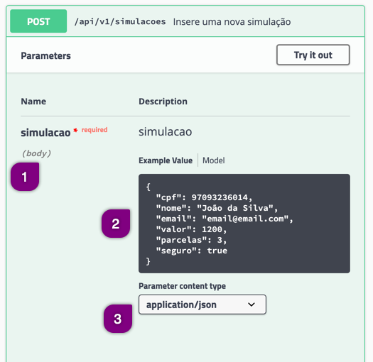

# Efetuando uma requisição POST

Já sabemos que uma requisição do tipo `POST` envia uma informação para ser registrada (cria algum registro).
O Rest-Assured utiliza o método `post()` para isso. Ele deve ser usando sempre depois do método `then()`.

Como o intuito do `POST` é enviar dados, podemos fazê-lo de duas formas:
* através de *form parameters*
* através de *body parameters*

Logo é sempre necessário informar, via método `given()` o tipo de envio de dados.

**Exemplo de código**

```java
@Test
public void exemploPOST() {
    given().
        param("nomeDoParametro", "valorDoParametro"). // form parameter
        body(objeto).                                 // body parameter
    when().
        post("/simulacoes");
}
```

## Observações

* nunca será necessário usar o *form parameter* em conjunto com o *body parameter*, o código acima é apenas um exemplo para ilustrar a utilização dos métodos
* para o *form parameter* tento o método `param` quando o método `formParam` funcionam
* não será escopo deste treinamento mostrar exemplos de *form parameter*

## Como efetuar uma requisição com um parâmetro de body

O caso mais comum do uso do método `POST` é informar os dados através do *request body*. Ele é utilizado através do método `body()` após o uso do método `given()`.

Antes de tudo é importante informar o tipo de dados que estamos enviando para a *body*. Para isso utilizamos o método `contentType()`, informando como parâmetro o tipo de dados.

Quando visualizamos a documentação do [POST em Simulações](http://localhost:8089/swagger-ui.html#/Simula%C3%A7%C3%B5es/novaSimulacaoUsingPOST) veremos que ele necessita, como "campo obrigatório" um objeto de simulação como *request body* que é apresentado pelo nome *body* abaixo do nome do atributo/objeto.



1. o atributo/objeto **simulacao** é obrigatório, e o tipo de parâmetro é um **body** (*request body*)
2. será necessário enviar os atributos descritos no exemplo
3. o tipo de dados que deve ser enviado é **application/json**

Note que o objeto *simulacao* é um objeto JSON.

### Informando um objeto JSON, a forma mais simples

Há sempre a forma mais simples e a melhor forma. Nos próximos tópicos aprenderemos a melhor forma mas, por enquanto, a forma mais simples nos dará a visão completa de como efetuar um `POST` com o RestAssured.

Precisamos enviar os seguintes dados:
* nome
* email
* cpf
* valor
* parcelas
* seguro

Como os dados devem ser enviados pelo body estes dados devem ser enviados através de um objeto. A forma mais simples é a criação de um `JSONObject`.

#### JSONObject

Ele é uma classe de uma biblioteca `org.json` que já está no `pom.xml` do projeto. Ela é uma coleção de chave-valor muito semelhante a um [Map](https://docs.oracle.com/javase/8/docs/api/java/util/Map.html) em Java.

No caso do JSONObject e chave (primeiro parâmetro) é o nome do atributo e o valor (segundo parâmetro) é o valor do atributo.

```java
JSONObject dados = new JSONObject();
dados.put("atributo", "valor");
```

O exemplo completo do JSONObject para os dados que precisamos enviar seria:

```java
JSONObject dados = new JSONObject();
dados.put("nome", "Deltrano");
dados.put("cpf", "12345678930");
dados.put("email", "teste@gmail.com");
dados.put("valor", 22000);
dados.put("parcelas", 2);
dados.put("seguro", true);
```

## Exemplo completo

Sempre que houver a necessidade de efetuar um `POST` com um *body* devemos seguir estes passos:
1. Criar o objeto de dados para submissão (neste momento o `JSONObject`)
2. Informar como pré-condição (`given()`):
   * o content type do objeto (`contentType()`)
   * a body contendo o objeto como parâmetro, sendo enviado como `toString()`

O `toString()` é necessário para transformar os dados informados no `JSONObject` em um objeto JSON.

```java
// objeto que será enviado
JSONObject dados = new JSONObject();
dados.put("nome", "Deltrano");
dados.put("cpf", "12345678930");
dados.put("email", "teste@gmail.com");
dados.put("valor", 22000);
dados.put("parcelas", 2);
dados.put("seguro", true);

given().
    contentType(ContentType.JSON). // informando o content-type do objeto
    body(dados.toString())         // informando o objeto que será enviado
```
