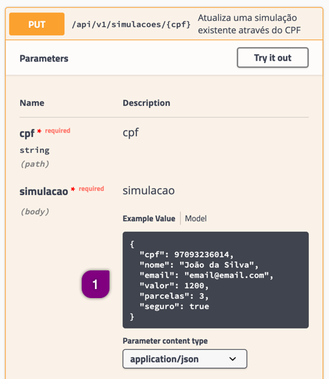

# Efetuando uma requisição PUT

O método `PUT` altera informações de um registro já existente. Normalmente um parâmetro, que é um identificador único do registro, é informado como *path parameter*.

Exemplo:
`PUT /v1/api/simulacaoes/{cpf}`

É necessário verificar na documentação da API quais parâmetros são necessário informar para que a alteração dos dados seja executada.
O Rest-Assured utiliza o método `put()` que deve ser utilizado depois do método `then()`.

**Exemplo de código**
```java
@Test
public void exemploPUT() {
    given().
        pathParam("nomeDoParametro", "valorDoParametro").
    when().
        put("/simulacoes/{nomeDoParametro}");
}
```

## Aspectos importantes

Várias implementações de desenvolvimento divergem entre sobre a atualização de registros. Algumas implementações analisam quais dados foram enviados e atualizam somente este, outras necessitam do objeto completo para atualizar os registros.

Na documentação do método `PUT` para Simulações note que é necessário enviar como parâmetro de *body* todo o objeto de Simulação.



## Como proceder na atualização de dados

Dificilmente temos certezas do tipo de implementação sobre a atualização de registros. Logo adote sempre a abordagem de enviar todos os dados, mesmo que sejam os mesmos e não devam sofrer alterações.

Exemplo: se você apenas desejar alterar o atributo *nome* no registro, deverá enviar, além do *nome* alterado, os valores originais.

É recomendado que você utilize o padrão *builder* para construir o objeto com os dados.

Exemplo:

```java
String cpf = "66414919004";

Simulacao simulacao = Simulacao.builder().
        nome("Nova pessoa").
        email("novo.email@gmail.com").
        cpf("66414919004").
        valor(11000).
        parcelas(3).
        seguro(true).
        build();

given().
    pathParam("cpf", cpf).
    contentType(ContentType.JSON).
    body(simulacao).
when().
    put("/simulacoes/{cpf}").
```

No objeto `Simulacao` apenas o *nome* e *email* estão sendo alterados, porém todos os outros dados estão presentes na criação do objeto.

Note também que na pré-condição da requisição `given()` há um *path parameter* informando qual a chave de pesquisa do objeto (no caso o CPF) e também o objeto da simulação como parâmetro de *body*. Você já sabe, mas não custa lembrar: quando usamos um `pathParam` devemos informar o nome deste parâmetro entre chaves no envio da requisição.
