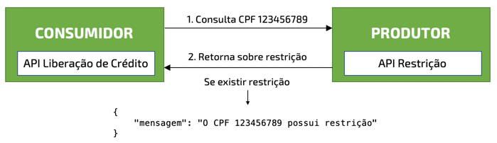
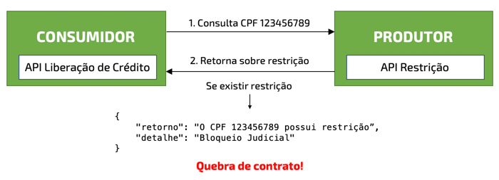

# Testes de Contrato para uma API REST

Testes de Contrato é o termo usado para uma técnica para garantir que o contrato entre um *produtor* (quem cria e mantém uma API) e o *consumidor* (quem consome a API) está mantido, ou seja, nenhuma mudança.

Se o *produtor* alterar o contrato sem avisar o *consumidor* este pode parar de funcionar.

Aplicar Testes de Contrato é uma prática comum quando consumimos alguma API que não esteja sob nosso controle ou para manter a sanidade da aplicação detectando mudanças não comunicadas.

No exemplo acima temos o *produtor* que disponibiliza uma API para consultar alguma restrição, dado um CPF. Há uma API de Liberação de Crédito de alguém que não é o produtor (um *consumidor*) e utilizará as informações retornadas para alguma ação.

O Contrato é o *consumidor* garantir que o *produtor* irá enviar, como retorno para um CPF com restrição, um JSON contento o atributo `mensagem` do tipo `texto`.

## Quando ocorre uma quebra de contrato?

Um contrato é quebrado quando:
* há atributos obrigatórios que não estão presentes no retorno
* há novos atributos obrigatórios presentes
* há mudança de nomes ou tipo de dados dos atributos

Digamos que agora o *produtor* fez as seguintes alterações:
* mudou o nome do atributo `mensgaem` para `retorno`
* adicionou mais um atributo obrigatório, o `detalhe`

Se relacionarmos com o exemplo anterior, onde o *consumidor* esperava apenas o atributo `mensagem` temos uma quebra de contrato por dois motivos:
1. mudança no nome do atributo `mensagem`
2. adição de um atributo obrigatório
